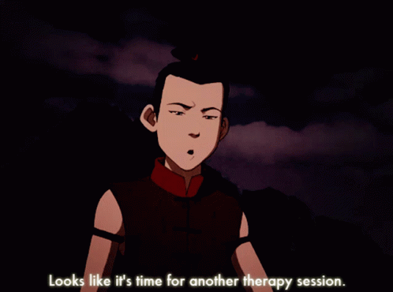

# TheraPy Session

I often find that I need to remember how to do some things when I don't work with Python or a certain module/library for a while. The goal of this repository is to serve as a reference for Python or specific libraries.

I'm also a TA in Penn State's Computer Science and Engineering department, so some of the content in here is designed to help benefit students who may not have much experience in Python.

At some point, I'll add a `requirements.txt` file.

## Current Contents
### Vanilla Python
1. Variables, Basic Printing, and Basic Arithmetic

### NumPy
1. Creating and Manipulating NumPy Arrays and Matrices

### OpenCV
All files in OpenCV are empty

## Project Name Inspiration
When I made this project, I had the scene from Avatar: The Last Airbender where Sokka was trying to give Aang a therapy session stuck in my head. Hence, "TheraPy Session" is the name I gave the project.

  

Note: I don't own the copyright to this image. I'm pretty sure that belongs to Nickelodeon / Paramount Global.